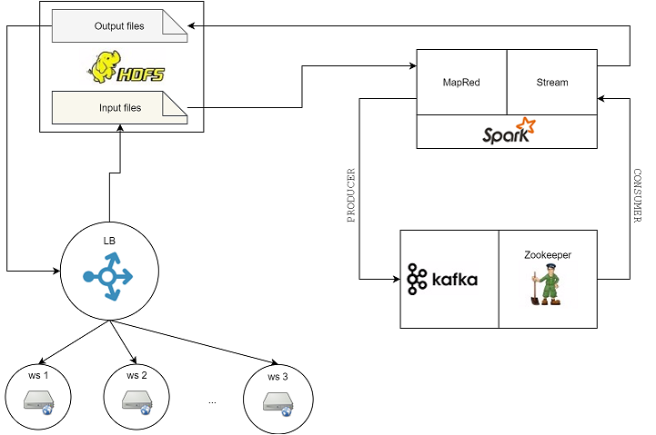

# spark kafka producer consumer example

[](https://travis-ci.org/mjaglan/kafka-spark-example)

## Problem Statement

The customer runs a website and periodically is attacked by a botnet in a Distributed Denial of Service (DDOS) attack. Given a log file in Apache log format from a given attack, use it to build a simple real-time detector of DDOS attacks.

### Requirements

- ##### Ingest
	- Start with reading the file from the HDFS file system
	- Write a tool to read the log file and put messages on the message system such as Kafka

- ##### Detection
	- Write an application which reads messages from the message system and detects whether the attacker is part of the DDOS attack
	- Once an attacker is found, the ip-address should be written to a results directory which could be used for further processing
	- An attack should be detected one to two minutes after starting

### Possible Solution



Assuming a user cannot send multiple requests at a given instance of time, duplicate IP addresses for a timestamp will be marked as suspicious botnet attack. Example - A machine 19.4.31.13 sends request at 25/May/2015:23:11:15 two or more times. This system will detect it as botnet attack and block it from sending any future requests.


### Tools 
```
Zookeeper 3.4.5
Kafka 8.2.1
Scala 2.10
Spark 1.6.1
Hadoop 2.6.0
Java 1.7
GGTS 3.6.4.RELEASE
Eclipse Luna SR1 (4.4.2)
Eclipse Buildship Gradle 1.0.16
Eclipse Scala IDE 4.4.1
```

